<!-- insert logo V(^.^) ZenRailz Animation V(^.<)}}}
Zenichi and Railisu -->

## Character Creation

The birth of Zenichi and Railisu starts with modelling and design. Models are created using VRoid Studio.

    
Installation of VRoid Studio

    <ol>
        <li>Navigate to <a href="https://vroid.com/en/studio">VRoid Studio</a> official website
        </li>
        <li>Download the latest version</li>
    </ol>

    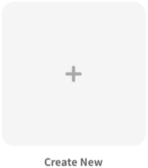
    To start creating a model, launch VRoid Studio. Click on the Create New button to get started. You may also choose to open an existing project if it has the <code>.vroid</code> extension.
     

    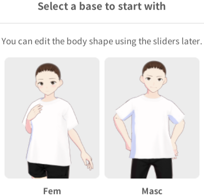
    Next, choose either a feminine or masculine base mesh. The difference will be in terms of its physique. Hairstyle, animation, etc will still remain flexible and interchangeble. However, you will not be able to edit or reselect the base mesh after this confirmation, unless you create a new project.
     

    Now, feel free to customise your model to your heart's content. You may choose to use the presets design or edit them to create your own. 

    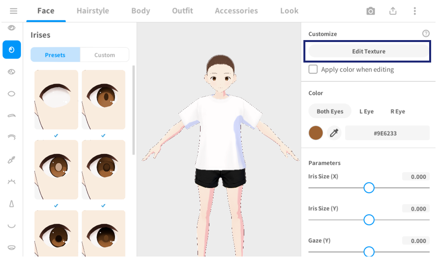

    For most components, there is an option to edit its texture. You may select any of the presets of your preference and use it as a base. Click on the "Edit Texture" button and let your creativity run wild.

    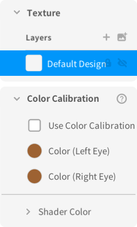
    

        In the left panel, there are "Layers" section shows the various overlays you may have on your model. You may choose to hide any of the layers by clicking on the "eye" icon , or lock any layers by clicking the "lock" icon  to prevent accidental adjustment.
    

    

        Right-click on any layer of interest to view more options, such as delete and duplicate.
    

     

    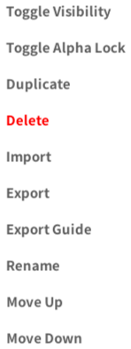
    

        As there are limitations to the in-house customisation tools, you may wish to export the layer to an external image editor that suits your needs.
    

    

        Right-click on the layer that you wish to export and click on "Export". The exported file will be in <code>.png</code> format with everything you have design on it thus far. If you wish to have some guiding lines while you edit the image in the external image editor, you may also wish to click on "Export Guide". Add it as a layer beneath your drawing and reduce its opacity. It will helps you to visualise better.
    

     

    Below are some examples of exported guides.

    
    
    

    Once you have completed your design, you may import it back into VRoid Studio. Click on the image import icon . When you are ready, hit <code>CTRL + S</code> to save your project. Close the editor by clicking on the X icon  near the top-left of the editor. and check the items you wish to save. Click on "Save as new item". The items will then be saved as a custom item in each of the respective categories.

    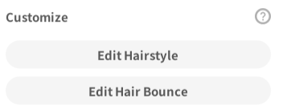
    For hairstyles, we can add physics to make them behave similar to how they will sway in reality. To do so, select "Edit Hair Bounce". Refer to the <a href="https://vroid.pixiv.help/hc/en-us/articles/900006910023-I-want-to-edit-hair-bounce">official document</a> by VRoid Studio for further tutorial and explanation.
     

    Head over to the Photo Booth to test your model. Click on the camera icon  at the top-right of VRoid Studio. Close the Photo Booth when you are done.

    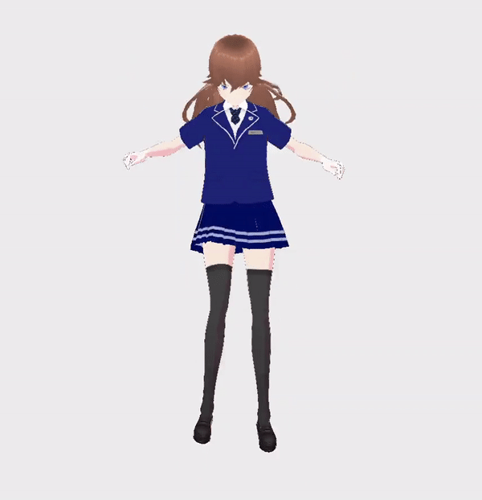

    After all the hardwork, it is time to export your model. Click on the export icon  at the top-right of VRoid Studio. Select "Export as VRM".

    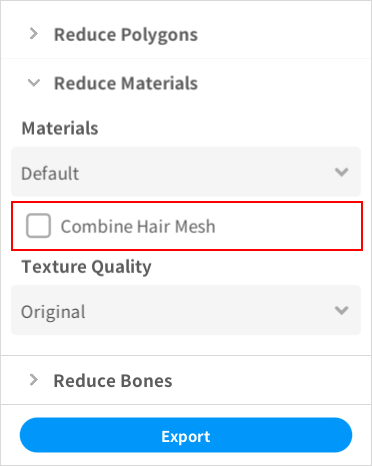
    Expand the "Reduce Materials" accordion and uncheck "Combine Hair Mesh". This will allow us to have control over the idividual hair bones when we import into Unity.
     

    
Shortcut Keys

    Refer to the <a href="https://vroid.pixiv.help/hc/en-us/articles/360012333453-Shortcut-Keys">official documentation</a> for the various shortcut keys. Using them may improve your experience with VRoid Studio. 

    
Sharing custom items

    

        For Windows, navigate to <code>C:\Users\{your account}\AppData\LocalLow\pixiv\VRoid Studio\custom_items</code>. In this directory, there are many sub-directories prefixed with <code>N00-</code>. The suffix of the sub-directory name represent the category.
    

    

        In each sub-directory, the items are initially named by Vroid Studio in in the format of <code>yyyy-MM-dd-HH-mm-ss-fff.vroidcustomitem</code>. It is advisable to rename it for future reference.
    

    

        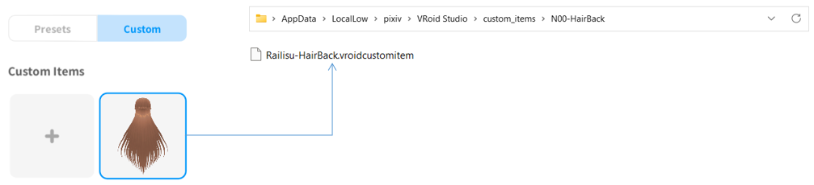
    

    

        To share the custom item, simply share the file with the <code>.vroidcustomitem</code> extension.
    

    

        To import a custom item you received from external sources, copy the file with <code>.vroidcustomitem</code> extension into their respective category folder. Relaunch VRoid Studio and you will be able to see the new custom item in that category ready for use.
    

## Character Touch-up

    You may have noticed that character you created with VRoid Studio may be a little awkward, where some of the hair physics may not be natural. This can be adjusted in external platforms like Unity.

    
Installation of Unity

    <ol>
        <li>Navigate to <a href="https://store.unity.com/compare-plans">Unity official website</a>
        </li>
        <li>Select your plan</li>
        <li>Follow on-screen instructions</li>
    </ol>

    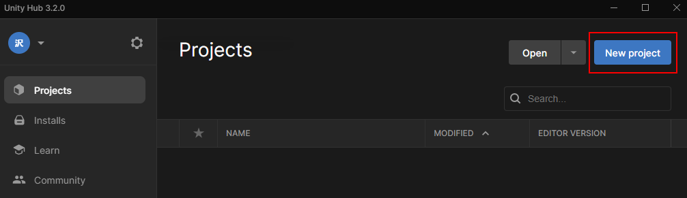
    To create a new Unity project, we will launch the Unity Hub desktop application and click on "New Project".
     

    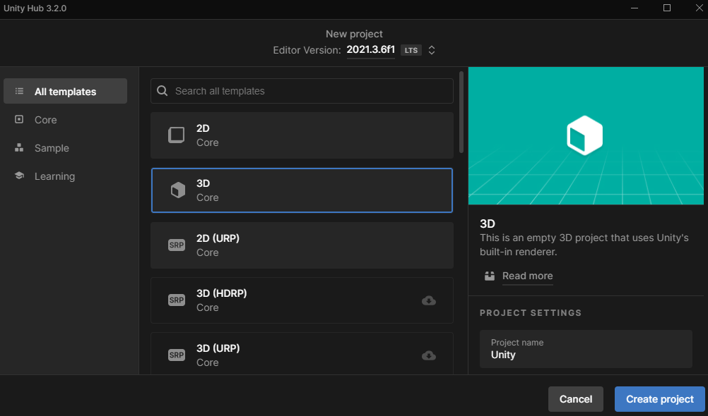
    Select the templated "3D" and give your project a name and location to save. Click on "Create Project" when ready.
     

    In order for unity to be able to read and write VRM files, we have to import a custom package called <code>UniVRM</code>.

    
Download UniVRM

    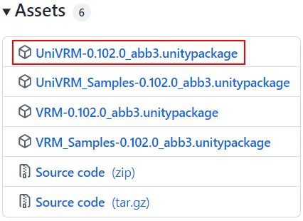
    <ol>
        <li>Navigate to <a href="https://github.com/vrm-c/UniVRM/releases">UniVRM release page</a>
        </li>
        <li>Choose the latest release</li>
        <li>
            From the Assets section, download the package with name in the format of <code>UniVRM-xxx.unitypackage</code>
        </li>
    </ol>
     

    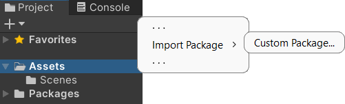
    Import the UniVRM package into your project by either dragging the file into the "Assets" folder, or right-click the "Assets" folder, then import the custom package. You may also perform the import via the "Assets" tab in the toolbar at the top of the window.
     

    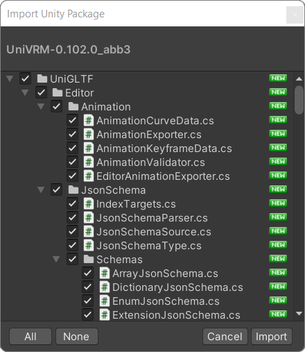
    A review window will appear. Check all the files and click on "Import".
     

    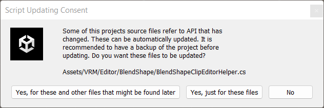
    Afterwhich, you may see pop-up window seeking your consent to update scripts. Select "Yes, for these and other files that might be found later".
     

    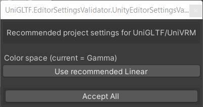
    A pop-up regarding the usage of linear color space may appear. Click on "Use recommended Linear". Close the window when it is done.
     

    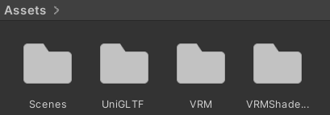
    New folders will be generated in the "Assets" folder upon the successful import of UniVRM package.
     

    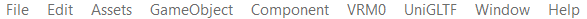
    The toolbar will also be updated with a "VRM0" menu option.
     

    To import your model, click on that "VRM0" menu and follow on-screen instructions, which will lead you to locate your VRM and save it to your preferred location. It is advisable to create a folder in the "Asset" directory.

    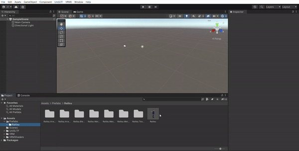
    Upon success, navigate to your model in the directory created. Drag the <code>prefab</code> file to the <code>SampleScene</code>.
     

    To view the physics created, click on the "play" icon 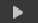 to start the game engine. You will be directed to the "Game" tab. Switch back to the "Scene" tab 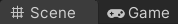.

    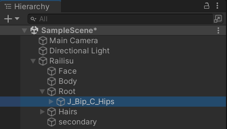
    In the "Hierarchy" panel, look for the hip bone and select it. Use the "Move" tool 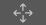 to shake up your model to view the physics at work.
     

    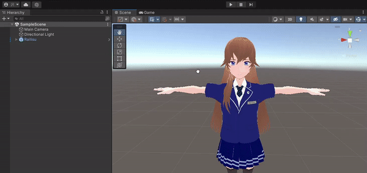
    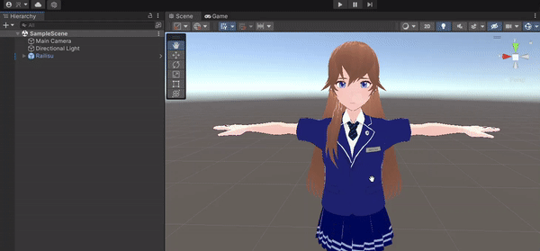

    Sometimes, we can see that certain body parts, such as hair, penetrates through the body. We can fix this by adjusting the coliders.

    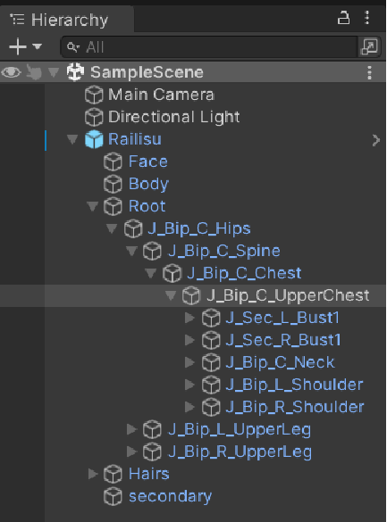
    For example, in the case of Railisu, her side hair will penetrates her chest if she turns her head or jumps around. To fix this, locate her upper chest component in the model.
     

    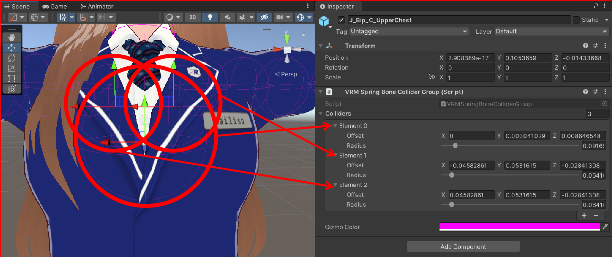
    You will see many Gizmos (purple lines) appeared. In the inspector panel, there is a "VRM Spring Bone Collider Group (Script)". There are 3 colliders in this group, which corresponds to 3 Gizmos. Slide the radius or adjust the values to identify the Gizmos of your interest.
     

    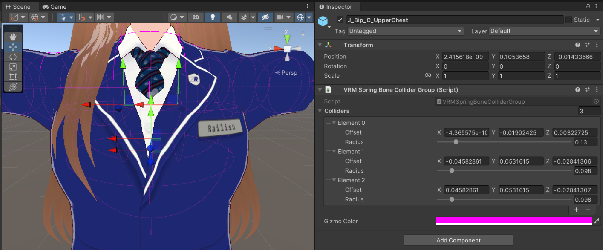
    For Railisu, we have made adjustment to all 3 Gizmos, such that they cover a wider area and leaves little gap for her hair to slip into her chest when she is in action.
     

    The adjustment of such colliders are not limited to the chest area. For other parts such as the arms and leg, you have to go through the "Hierarchy" and find the component with the respective collider group that will affect the body part of your interest.

    When you are satisfied with the model. You may export it into other VRM-supported softwares, such as the <a href="https://learnmmd.com/downloads/">MikuMikuDance</a> software.

    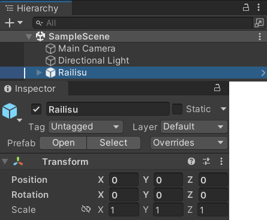
    Before we being export, ensure that the model is in the right transform configuration. From the "Hierarchy" panel, select your model. Then in the "Inspector" panel, expand the "Transform" section and update to this configuration if they are not already done.
     

    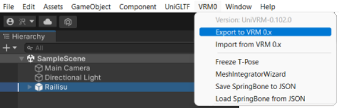
    To export VRM from Unity, select the model you wish to export and click on "Export to VRM 0.x".
     

    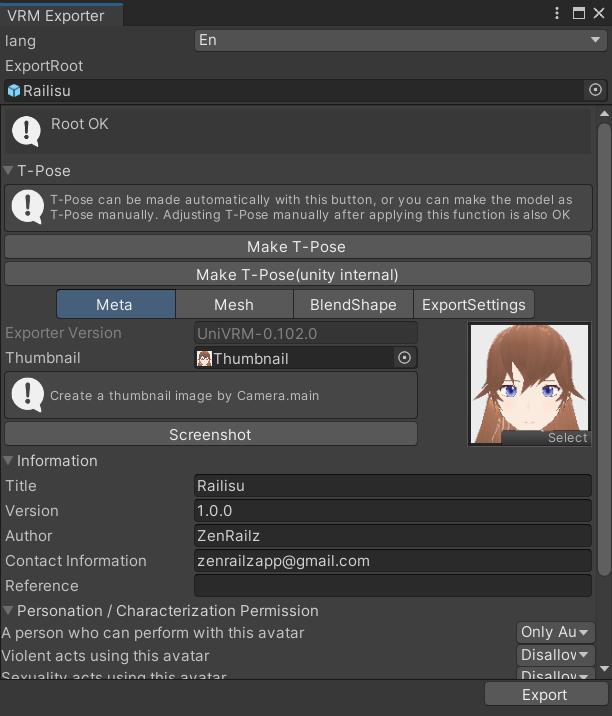
    Review the configurations and click on "Export".
     

## Character Animation

There are few ways we can add animations to our models.

### Mixamo

We can download free animations from Mixamo and import to Unity.

    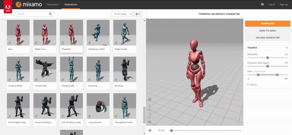

    Navigate to <a href="https://www.mixamo.com">Mixamo</a>. Click on the "Animation" tab in the navigation bar at the top of the website. You may explore the various animations available or search of a specific animation you may have in mind. Click on the thumbnail animation to see the preview and its configuration on the right. You may adjust the settings to your preference.

    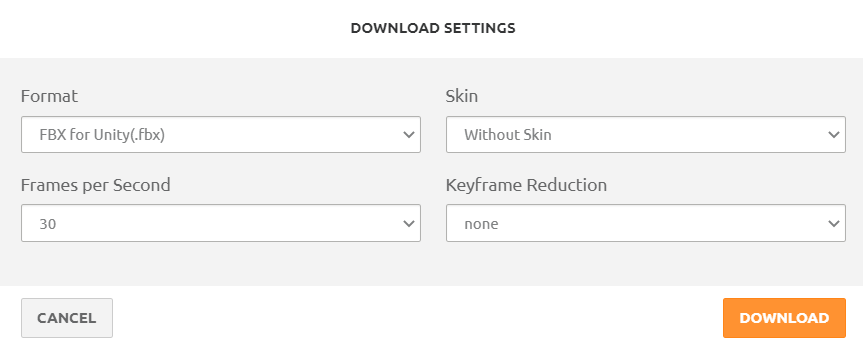
    To download the animation, click on the "Download" button. You may have to create an account and sign in for this function to work.
      
    For import to Unity, select "FBX for Unity(.fbx) as the format. Select "Without Skin" as we will be using our own model in Unity.
     

    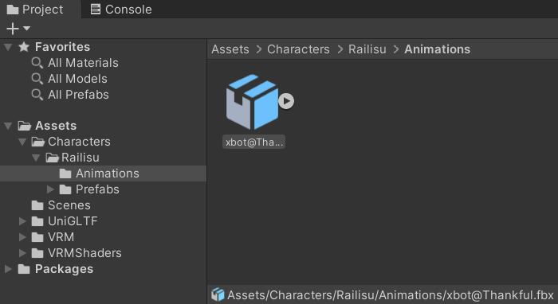
    In unity, create a new folder to store animations. Copy the downloaded animation <code>.fbx</code> file from Mixamo into this folder.
     

    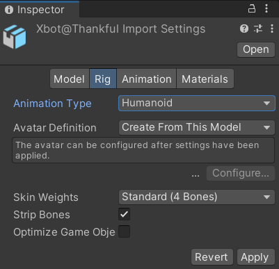
    Click on the imported file to open it in the "Inspector" panel. Switch to the "Rig" tab. Change the Animation Type to "Humanoid" and click on "Apply".
     

    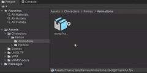
    To extract the animation from the downloaded file, click on the arrow button near the file to expand its content. Click on the animation file and press <code>CTRL + D</code> on your keyboard to duplicate the animation file. You may remove the downloaded file from Mixamo as it is no longer needed.
     

    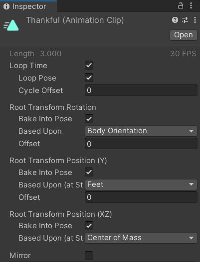
    Click on the animation file to view its configurations in the "Inspector" panel.
      
    Mark the "Loop Time" and "Loop Pose" checkbox, so that the animation will be in loop.
      
    Mark all "Bake Into Pose" for all Root Transformation.
      
    For Root Transformation Position (Y), change the value for Based Upon (at Start) to "Feet".
     

    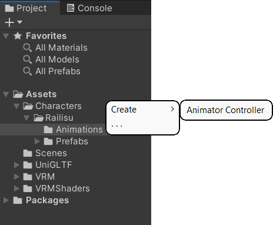
    In your animation directory, create a new Animator Controller.
     

    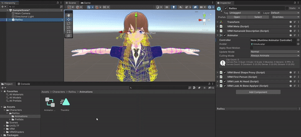
    In the "Hierarchy" panel, select your model.
      
    In the "Inspector" panel, scoll down till you see the "Animator" section.
    Drag the newly created animator controller file into the "Controller" field.
      
    Mark the "Apply Root Motion" checkbox.
     

    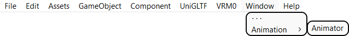
    Open the "Animator" window via the toolbar at the top of the screen. A new window will open.
     

    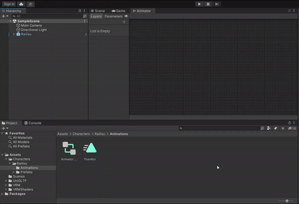
    If the "Animator" window does not have anything, select your model in the "Hierarchy" panel. Drag the animation file to the "Animator" tab.
     

    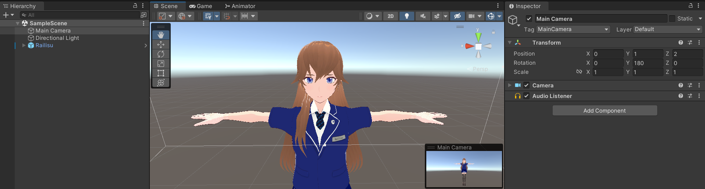
    Switch back to the "Scene" tab. In the "Hierarchy" panel, select the "Main Camera". In order to have a better view of our model when we run the program, we will set its transformation to the following configuration:
    <table>
        <tr>
            <td></td>
            <td>X</td>
            <td>Y</td>
            <td>Z</td>
        </tr>
        <tr>
            <td>Position</td>
            <td>0</td>
            <td>1</td>
            <td>2</td>
        </tr>
        <tr>
            <td>Rotation</td>
            <td>0</td>
            <td>180</td>
            <td>0</td>
        </tr>
        <tr>
            <td>Scale</td>
            <td>1</td>
            <td>1</td>
            <td>1</td>
        </tr>
    </table>
     

    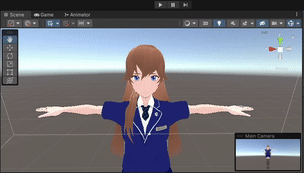
    To preview the animation of your model, click on the "play" icon.
    

        
Fullscreen Mode

        

            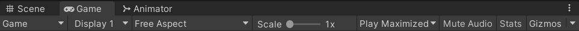
            Change to "play maximised".
             
        

    

    You may notice that some of the body parts may sink into another. We can modify this in the "Animation" window.
     

    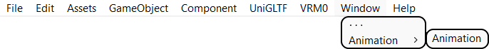
    Open the "Animation" window via the toolbar at the top of the screen. A new window will open.
     

    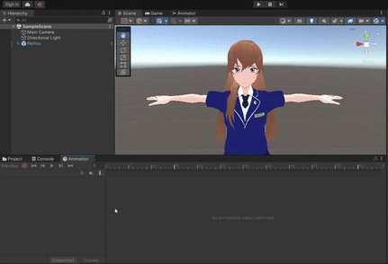
    In the "Animation" window, you can adjust each the position of each body part at each keyframe. You may switch to the "Curves" tab as an alternative to adjusting the positions.
      
    To run a quick preview of the animation you have created, click on the "play" button in the "Animation" window. Note that some physics may not apply as this is only a quick preview of the animation.
     

    Voilà! We have successfully incorporated animation into our model via Unity!
      
    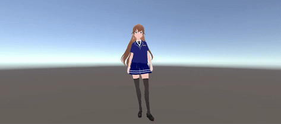

### MikuMikuDance

For dance-like animations, we can use the MikuMikuDance application.

    
Installation of MikuMikuDance

    <ol>
        <li>Navigate to <a href="https://learnmmd.com/downloads/">MikuMikuDance</a> official website
        </li>
        <li>Download the latest version</li>
        <li>Follow the instructions on the webpage</li>
    </ol>

    Before proceeding, we have to fisrt export our model from Unity to a <code>.vrm</code> file, then convert to <code>.pmx</code> format.

    
Installation of VRM2PMXConverter

    <ol>
        <li>Navigate to <a href="https://www.nicovideo.jp/watch/sm34705374">VRM2PMXConverter</a> download page
        </li>
        <li>Download the latest version</li>
    </ol>

    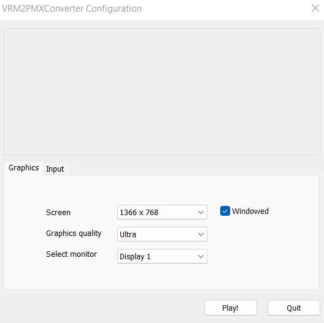
    Launch the VRM2PMXConverter application.
      
    Click on "Play!".
     

    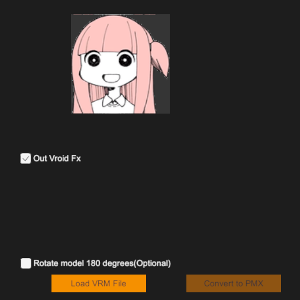
    Click on "Load VRM File" and select the <code>.vrm</code> file you have exported from Unity.
     

    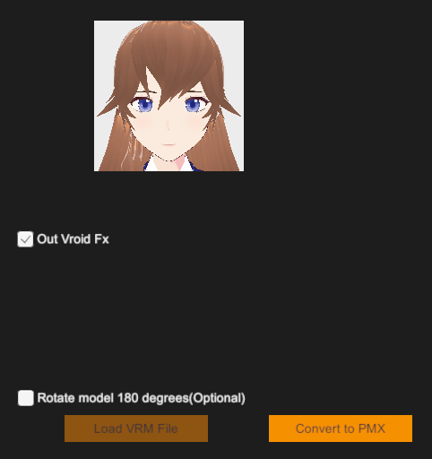
    Click on "Convert to PMX" button to start the converion.
      
    On completion, a new folder containing the <code>.pmx</code> file will be created in the same directory as the imported <code>.vrm</code> file.
     

    Launch the MikuMikuDance application.
      
    
     

    Click on the "To model" button near the bottom-left of the central screen. Select the <code>.pmx</code> file to import into the application.
     

    We can download free animations from <a href="https://learnmmd.com/downloads/">LearnMMD.com</a> or <a href="https://mmdmotiondl.tumblr.com/">MMD Motion Downloads</a>.

    
    To load animations into your model, select "load motion data(M)" from the dropdown list of the "File" tab in the navigation toolbar. Look for the <code>.vmd</code> that you may have downloaded.
     

    
    On load, your model will assume the default pose of the animation. Click on "play" to see the animation at work.
      
    Motion data taken from ぺんたさん's <a href="https://www.nicovideo.jp/watch/sm25418510">地球最後の告白を</a>.
     

## Recording

---

## References

### Tools

- [VRoid Studio](https://vroid.com/en/studio)
- [Unity](https://unity.com/)
- [Inkscape](https://inkscape.org/)
- [Paint.NET](https://www.getpaint.net/)
- [OBS Studio](https://obsproject.com/)
- [MikuMikuDance](https://learnmmd.com/downloads/)

### Resources
- [Mixamo](https://www.mixamo.com/)
- [Booth](https://booth.pm/en)
- [MMD Motion Downloads](https://mmdmotiondl.tumblr.com/)

### Tutorials

- [VRM and related softwares](https://vrm.dev/en/vrm/vrm_about.html)
- [Import Model from VRoid Studio into Unity](https://www.youtube.com/watch?v=IrIn9wRYqUI&ab_channel=ReForgeMode-UnityTutorials)
- [Import Animation from Mixamo into Unity](https://www.youtube.com/watch?v=4iQIqB5ewOw&ab_channel=ReForgeMode-UnityTutorials)
- [Import and Export Presets from VRoid Studio](https://www.youtube.com/watch?v=8fyBiXvkvS4&ab_channel=LadyAska)